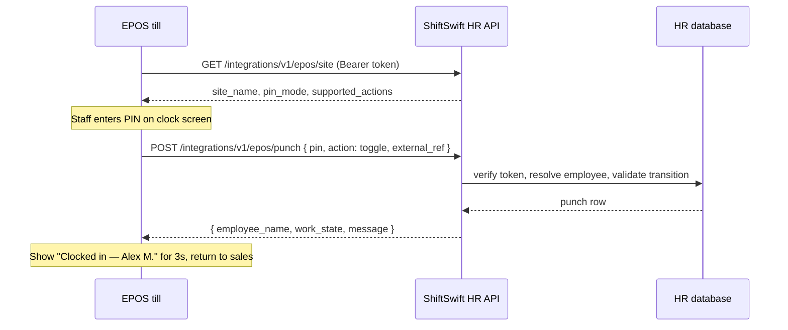

# EPOS / till time punch integration — API contract (draft)

**Status:** Phase 2a implemented (June 2026) — device tokens + one-shot punch API. Phase 2b (PIN-only) pending.  
**Audience:** DineSwift EPOS, third-party tills, shared kiosk tablets  
**Related:** `backend_stub/modules/time_punch/kiosk.py`, `punch-kiosk.html`, [production_readiness.md](./production_readiness.md)

---

## Goals

1. **No employee portal login** — till sends PIN (and optionally employee number); HR records the punch.
2. **One round-trip** — PIN entry triggers punch immediately (no separate session + button tap).
3. **Device trust, not user JWT** — EPOS holds a **site integration token**, not an employee bearer token.
4. **HR data isolation** — punch API only; no access to payroll, documents, or EPOS sales data.

---

## What exists today (baseline)

| Flow | Auth | Steps | Auto punch? |
|------|------|-------|-------------|
| Employee PWA | Employee JWT | GPS / premises QR | Manual clock button |
| Kiosk tablet | `clock_token` in URL + employee ID + PIN | PIN → 8‑min session → tap In/Out | No |
| Admin override | HR JWT | Manual entry | Yes |

**Reuse from kiosk:** PIN verification (`kiosk_pin_hash`), site resolution, `_validate_punch_transition`, `_insert_time_punch` with `punch_method`.

**Gap:** no device token table, no PIN-only lookup, no one-shot punch endpoint, `PunchMethod` has no `"epos"` value yet.

---

## Authentication model

### Integration token (per punch site or per till)

Each EPOS terminal (or site) gets a long-lived secret issued by HR in Admin → Time punch → **Integrations**.

| Header | Value |
|--------|--------|
| `Authorization` | `Bearer <integration_token>` |
| `X-Request-Id` | Optional UUID for idempotency / support |

Token properties:

- Scoped to **one `tenant_id`** and **one `punch_site_id`** (recommended) or tenant-wide with `site_id` in body.
- Stored as **bcrypt hash** server-side; plain token shown once at creation.
- Revocable; optional `expires_at`.
- **Never** interchangeable with employee or HR JWT.

### Suggested table: `epos_integration_tokens`

```sql
CREATE TABLE epos_integration_tokens (
  id              SERIAL PRIMARY KEY,
  tenant_id       INTEGER NOT NULL REFERENCES tenants(id),
  punch_site_id   INTEGER NOT NULL REFERENCES punch_sites(id),
  label           TEXT NOT NULL,           -- e.g. "Bar till 1", "DineSwift POS #3"
  token_prefix    VARCHAR(12) NOT NULL,    -- first 8 chars for admin UI identification
  token_hash      TEXT NOT NULL,
  is_active       BOOLEAN NOT NULL DEFAULT TRUE,
  created_at      TIMESTAMPTZ NOT NULL DEFAULT NOW(),
  created_by      TEXT,
  revoked_at      TIMESTAMPTZ,
  last_used_at    TIMESTAMPTZ
);
```

---

## Base URL

```
https://api.shiftswifthr.co.uk/integrations/v1/epos
```

All endpoints return JSON. Times are ISO 8601 UTC unless noted.

---

## Endpoints

### 1. `GET /integrations/v1/epos/site`

Verify token and return site context (call on till startup).

**Response `200`**

```json
{
  "tenant_id": 42,
  "site_id": 7,
  "site_name": "Spinningfields — Bar",
  "timezone": "Europe/London",
  "pin_mode": "employee_id_and_pin",
  "supported_actions": ["in", "out", "break_start", "break_end", "toggle"],
  "integration_label": "Bar till 1"
}
```

`pin_mode` tenant setting:

| Value | Till UI |
|-------|---------|
| `employee_id_and_pin` | Staff ID + PIN (current kiosk behaviour) |
| `pin_only` | PIN only — HR must enforce **unique PINs per tenant** |

---

### 2. `POST /integrations/v1/epos/punch` (primary)

Validate credentials and record a punch in **one request**.

#### Request

```json
{
  "pin": "4821",
  "employee_id": 12,
  "action": "toggle",
  "external_ref": "epos-txn-9f3a2c",
  "device_clock": "2026-06-19T09:01:00+01:00"
}
```

| Field | Required | Description |
|-------|----------|-------------|
| `pin` | Yes | 4–6 digit kiosk PIN (same as HR sets today) |
| `employee_id` | If `pin_mode=employee_id_and_pin` | Internal employee ID |
| `action` | Yes | See actions below |
| `external_ref` | Recommended | EPOS correlation ID (idempotency) |
| `device_clock` | Optional | Till local time for audit only; server uses `NOW()` for `punched_at` |

#### Actions

| `action` | Behaviour |
|----------|-----------|
| `in` | Clock in (fails if already in or on break) |
| `out` | Clock out (fails if off) |
| `break_start` | Start break (must be clocked in) |
| `break_end` | End break |
| `toggle` | **Recommended for EPOS** — `off` → `in`, `clocked_in` → `out`, `on_break` → `break_end` |

#### Response `200`

```json
{
  "ok": true,
  "punch_id": 91824,
  "employee_id": 12,
  "employee_name": "Alex Morgan",
  "site_id": 7,
  "site_name": "Spinningfields — Bar",
  "punch_type": "in",
  "punch_method": "epos",
  "work_state": "clocked_in",
  "punched_at": "2026-06-19T08:01:03.412Z",
  "message": "Clocked in"
}
```

`message` is human-readable for till display (e.g. “Clocked in”, “Clocked out”, “Break ended”).

#### Idempotency

If `external_ref` was already used for a successful punch from the same token within 24h, return **`200`** with the **original** punch payload (do not double-record).

---

### 3. `POST /integrations/v1/epos/punch/preview` (optional)

Validate PIN without writing a punch — useful for till UI (“Welcome, Alex”) before confirming shift start.

**Request:** same as punch, with `"dry_run": true` or dedicated preview endpoint.

**Response `200`**

```json
{
  "ok": true,
  "employee_id": 12,
  "employee_name": "Alex Morgan",
  "work_state": "off",
  "next_action": "in",
  "would_punch_type": "in"
}
```

---

## Error responses

Consistent shape:

```json
{
  "ok": false,
  "error": "incorrect_pin",
  "message": "Incorrect PIN"
}
```

| HTTP | `error` | When |
|------|---------|------|
| 401 | `invalid_token` | Missing / revoked integration token |
| 403 | `incorrect_pin` | PIN mismatch (do not reveal if employee exists) |
| 403 | `employee_inactive` | Terminated / inactive employee |
| 403 | `site_not_assigned` | Employee not assigned to this punch site |
| 404 | `employee_not_found` | Bad `employee_id` (only when ID required) |
| 409 | `invalid_transition` | e.g. clock in while already in |
| 409 | `duplicate_pin` | PIN-only mode: ambiguous PIN (internal config error) |
| 429 | `rate_limited` | Too many failed PIN attempts |
| 503 | `time_punch_disabled` | Tenant has no active punch sites |

**Security:** failed PIN responses must be identical whether employee ID, PIN, or both are wrong.

---

## PIN-only mode (till-friendly)

When tenant enables `pin_only`:

1. HR enforces **unique** kiosk PINs across active employees (admin UI validation on save).
2. Punch request omits `employee_id`:

```json
{
  "pin": "4821",
  "action": "toggle"
}
```

3. Server lookup:

```sql
SELECT id, first_name, last_name, kiosk_pin_hash, status
FROM employees
WHERE tenant_id = $1 AND kiosk_pin_hash IS NOT NULL AND status IN ('active', 'onboarding')
-- verify bcrypt in application code; reject if 0 or 2+ matches
```

4. If two employees share a PIN → `409 duplicate_pin` and HR alert.

---

## Audit & payroll fields

Extend `time_punches` (or use existing columns):

| Column | Value for EPOS |
|--------|----------------|
| `punch_method` | `"epos"` (add to `PunchMethod` literal) |
| `user_agent` | `"epos/dineswift"` or partner id |
| `ip_address` | Till public IP if available |
| `external_ref` | EPOS transaction / shift id (new nullable column) |
| `integration_token_id` | FK to `epos_integration_tokens` (new nullable column) |

---

## Rate limiting

| Limit | Suggestion |
|-------|------------|
| Failed PIN per token | 10 / 15 min → `429` |
| Failed PIN per employee | 5 / 15 min → lock PIN attempts 30 min |
| Successful punches | 120 / min per token (normal till traffic) |

Log all failures to `audit_log` with `action=epos_punch_failed`.

---

## HR admin UI (future)

Under **Admin → Time punch → Integrations**:

- Create / revoke till token per site
- Copy token once (like API keys)
- Show `token_prefix`, `last_used_at`, label
- Toggle **PIN mode**: `employee_id_and_pin` vs `pin_only`
- Link to employee kiosk PIN management (existing)

---

## DineSwift EPOS — suggested till flow



**UX recommendations:**

- Dedicated “Clock in/out” soft key on waiter handset or back-office terminal.
- `toggle` avoids staff choosing in vs out.
- Show `employee_name` + `message` for 2–3 seconds.
- On `invalid_transition`, show `message` not raw error codes.
- Do not cache PIN; clear input after each attempt.

---

## Mapping from current kiosk API

| Today (kiosk) | EPOS (proposed) |
|---------------|-----------------|
| `GET /time-punch/kiosk/site?clock=…` | `GET /integrations/v1/epos/site` (Bearer token) |
| `POST /time-punch/kiosk/session` | Removed — merged into punch |
| `POST /time-punch/kiosk/punch` | `POST /integrations/v1/epos/punch` |
| `clock_token` in URL | `Authorization: Bearer …` |
| `punch_method: "kiosk"` | `punch_method: "epos"` |

Existing `punch-kiosk.html` can later call the one-shot EPOS endpoint internally (with a kiosk-scoped token) to get auto-punch behaviour on tablets too.

---

## Implementation phases

### Phase 2a — Minimal (MVP) ✅

- Migration: `093_epos_time_punch_integration.sql`
- `POST /integrations/v1/epos/punch` with `employee_id` + `pin` + `action=toggle`
- Admin: create/revoke token per site (Time punch → site detail → EPOS / till integration)
- Rate limit + audit log

### Phase 2b — Till polish

- `GET /site`, preview endpoint, idempotency on `external_ref`
- `pin_only` mode with uniqueness validation

### Phase 2c — DineSwift product

- Native clock screen in EPOS app
- Webhook optional: `punch_recorded` → EPOS workforce dashboard (out of scope for punch API itself)

---

## Example: clock in from till (curl)

```bash
curl -sS -X POST "https://api.shiftswifthr.co.uk/integrations/v1/epos/punch" \
  -H "Authorization: Bearer sshr_epos_live_8fK2…" \
  -H "Content-Type: application/json" \
  -H "X-Request-Id: 550e8400-e29b-41d4-a716-446655440000" \
  -d '{
    "employee_id": 12,
    "pin": "4821",
    "action": "toggle",
    "external_ref": "ds-till-3-shift-open-20260619"
  }'
```

---

## Open decisions (product)

1. **Break punches on till?** — Most venues use `toggle` only (in/out). Breaks stay on employee phone / kiosk. EPOS can hide `break_*` unless enabled per site.
2. **PIN-only vs ID+PIN default?** — Recommend **ID+PIN** for launch (matches current kiosk); offer PIN-only for small teams (&lt;30 staff) with uniqueness enforcement.
3. **Offline till?** — Out of scope; EPOS queues locally and syncs with `external_ref` when online (client responsibility).

---

## Acceptance criteria

- [ ] Till with valid token can clock staff in/out without employee JWT.
- [ ] One PIN entry → one punch (`toggle` in &lt;300ms p95 on LAN).
- [ ] Wrong PIN does not leak employee existence.
- [ ] Revoked token returns `401` immediately.
- [ ] Punch appears in HR timesheet with `punch_method: epos`.
- [ ] Duplicate `external_ref` does not create duplicate punches.
