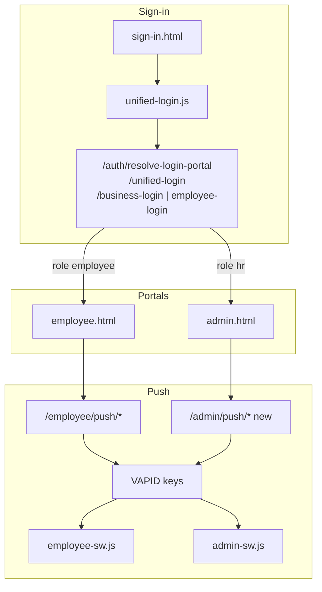

# Target state — unified login (web PWA) + push bell notifications

**Purpose:** Agreed end state before implementation.  
**Status:** Implemented (June 2026) — Phase 1–3 in progress on branch; see checklist below.  
**Related:** [business_admin_launch_checklist.md](./business_admin_launch_checklist.md), [native_ios_apps.md](./native_ios_apps.md)

---

## Goals

1. **One intuitive sign-in** on web/PWA for HR and employees — no “wrong portal” loops after MFA.
2. **Bell + push** on the portals that need real-time alerts — employees first, HR admin second.
3. **Keep master platform login separate** (security).

---

## Current state (summary)

| Area | Today |
|------|--------|
| Unified login UI | `sign-in.html` (canonical) + bundled iOS `index.html` — `unified-login.js`; Face ID via WebAuthn passkeys (`passkey-auth.js`) or native biometrics (`trusted-device.js`) |
| HR web PWA default | `business-login.html` (HR-only endpoint) |
| Employee web PWA | `employee-login.html` |
| Session expiry redirect | Mostly unified via `session-auth.js` / `auth-guard.js` (fixed loop) |
| Employee push | End-to-end: bell UI, `/employee/push/*`, `employee-sw.js`, VAPID |
| HR admin push | `admin-sw.js` can *display* push; **no** subscribe API or bell UI |
| Native apps | Three builds: unified app, employee-only, HR-only |

---

## Target state — login

### User experience

| User | Opens | Sees | Lands on |
|------|--------|------|----------|
| HR / manager | `app.shiftswifthr.co.uk` or HR PWA | One form: work email + password | `admin.html` |
| Employee | Same URL or employee PWA | Same form | `employee.html` |
| Platform master | Separate URL only | Master login | `master.html` |

- MFA and trusted device stay **on the same page** (no second login screen).
- Dedicated URLs (`business-login.html`, `employee-login.html`) remain as **redirects** to unified login for bookmarks and old links — not the primary UX.

### Technical target

| # | Change | Files / notes |
|---|--------|----------------|
| L1 | Default web login URL = `sign-in.html` (`native-app-login.html` redirects) | `session-auth.js` `resolveLoginUrl()`, `auth-guard.js` |
| L2 | HR Admin PWA install / open graph points to unified login | `admin-manifest.webmanifest`, install prompts |
| L3 | `business-login.html` → 302/meta redirect or JS redirect to unified login (keep SEO canonical) | `business-login.html`, `employee-login.html` |
| L4 | Sign-out links use unified login, not `business-login.html` | `admin.html`, `employee.html` topbar |
| L5 | HR portal 401 / session guard always `sign-in.html` | `admin-shared.js`, `auth-guard.js` |
| L6 | **No change** to master login isolation | `master.html`, `/auth/master-login` |
| L7 | Native **unified** app (`co.uk.shiftswifthr.app`) stays bundled `index.html` | `mobile/www/app/` |
| L8 | Employee / HR-only native apps: optional later deprecation or redirect to unified app | Product decision — Phase 3 |

### Out of scope (login)

- Merging master console into unified login.
- Social / SSO providers (future).

### Login acceptance criteria

- [x] HR: install PWA → sign in once → MFA (if required) → `admin.html` with no extra login step.
- [x] Employee: same flow → `employee.html`.
- [x] Expired session on `admin.html` → unified login → back to admin (not `business-login` loop).
- [x] Old bookmark `business-login.html` still works (redirects to unified login; `?legacy=1` keeps dedicated page).
- [ ] E2E smoke: unified login → admin overview (existing Playwright spec path).

---

## Target state — push bell notifications

Two layers (both where useful):

1. **OS push** — banner when app/tab closed (Web Push + service worker).
2. **In-app bell** — icon + unread count + list while portal is open.

### Employee portal (extend existing)

| # | Item | Status |
|---|------|--------|
| P-E1 | Topbar bell + enable banner | Done (`employee-push-alerts.js`) |
| P-E2 | Web Push subscribe | Done (`/employee/push/subscribe`) |
| P-E3 | Shift / clock / payslip events | Done (cron + document share) |
| P-E4 | In-app notification feed (history, mark read) | Done (`portal-notifications.js`, `/employee/push/notifications`) |
| P-E5 | iOS PWA: document “Add to Home Screen” + allow notifications | Ops / UX copy |

### HR admin portal (new)

| # | Item | Detail |
|---|------|--------|
| P-H1 | Bell in admin topbar | Done (`admin-push-alerts.js`, `portal-notifications.js`) |
| P-H2 | `GET/POST /admin/push/config`, `subscribe`, `unsubscribe` | Done — migration `092_admin_push_and_in_app_notifications.sql` |
| P-H3 | `send_admin_push()` in `modules/push/service.py` | Done |
| P-H4 | `admin-sw.js` `push` → `postMessage` to open tabs | Done (SHIFT_ALERT + sound) |
| P-H5 | Load `push-notifications.js` or `admin-push-alerts.js` on `admin.html` | Done |
| P-H6 | Settings → Notifications: push delivery prefs | Done for `missed_punch_hr`, `leave_request_hr`, `rtw_expiry` |

### Suggested HR push events (Phase 1)

| Event | Trigger | Deep link |
|-------|---------|-----------|
| Missed clock-in | `evaluate_missed_punch_alerts` | `admin.html#time-punch` |
| New leave request | Leave create/submit | `admin.html#leave` |
| RTW expiry (7 days) | Existing compliance job | `admin.html#compliance` or RTW section |

Extend later: grievance updates, rota publish confirm, document signing completed.

### Notification preferences

Extend `NOTIFICATION_PREF_EVENTS` / delivery options:

| Pref key | Today | Target |
|----------|-------|--------|
| `missed_punch_hr` | `email` only | `email`, `push`, `email_push`, `off` |
| `leave_request_hr` | (new) | same |
| `rtw_expiry` | `email` | add `push` / `email_push` for HR device |

Employees already have `email_push` on sign-in reminder; same pattern for HR.

### Server prerequisites

```env
VAPID_PUBLIC_KEY=...
VAPID_PRIVATE_KEY=...
VAPID_CONTACT_EMAIL=mailto:support@shiftswifthr.co.uk
```

Without VAPID, push config returns `enabled: false` (same as employee today).

### Platform notes

| Platform | Expectation |
|----------|-------------|
| Android Chrome PWA | Reliable Web Push |
| Desktop | Reliable |
| iOS Safari PWA | Web Push if added to Home Screen (iOS 16.4+); prompt UX matters |
| Unified native iOS app | Prefer Capacitor local notifications for shift-style alerts; Web Push optional |

### Push acceptance criteria

**Employee (regression)**

- [x] Enable bell → permission granted → subscription stored.
- [x] Shift / clock-in / clock-out reminder arrives as OS notification + bell sound in open PWA tab (`SHIFT_ALERT` + `CLOCK_ALERT_TYPES`).
- [x] Push prompt when opening Time clock tab (when punch sites configured).

**HR (new)**

- [x] HR enables bell on `admin.html` → subscription stored per user (long-press bell or context menu).
- [x] Missed clock-in + new leave request can send HR push (when pref is `push` or `email_push`).
- [x] Email-only pref still sends email, not push.
- [ ] Sign out explicit unsubscribe (deferred — subscription persists for re-login).

---

## Recommended implementation phases

### Phase 1 — Login consolidation (web) · ~1–2 days

L1, L3, L4, L5 + verify native unified app unchanged.  
Low risk; improves support tickets immediately.

### Phase 2 — HR push MVP · ~3–4 days

P-H1–H6, migration, `missed_punch_hr` push delivery, manual QA on Android + desktop.  
Reuse employee push/VAPID stack.

### Phase 3 — In-app bell feeds · ~2–3 days

Unread API + dropdown for employee and HR (not only OS toast).  
Optional polish.

### Phase 4 — Product cleanup · later

Single native app in App Store; deprecate employee/HR-only apps. **Done:** `sign-in.html` is canonical; `native-app-login.html` redirects with query/hash preserved.

---

## Architecture (target)



---

## Decisions needed before build

| # | Question | Recommendation |
|---|----------|----------------|
| D1 | Unify web login URL only, or also retire HR/employee native app variants? | Web first; native apps Phase 4 |
| D2 | HR push Phase 1 events — all three (missed punch, leave, RTW) or missed punch only? | Missed punch + leave first |
| D3 | Unsubscribe on sign out? | Keep subscription; user disables in Settings |
| D4 | In-app bell feed in Phase 2 or Phase 3? | Phase 3 (OS push first) |

---

## Test plan (when implementing)

1. **Login:** Playwright unified login → admin + seed employee session → employee hash.
2. **Push:** Integration test `send_admin_push` with mocked `pywebpush`; manual device test checklist.
3. **Production:** VAPID present on `api.shiftswifthr.co.uk`; one HR + one employee device per tenant pilot.

---

*When this doc is approved, implementation order: Phase 1 (login) → Phase 2 (HR push) → Phase 3 (feeds).*
